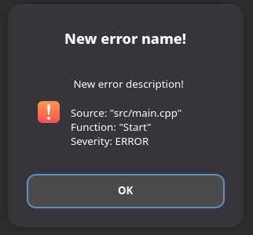
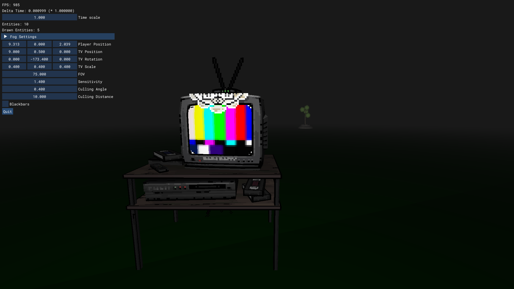

# SLAM

[](https://wakatime.com/badge/user/ebdd5199-39f1-41e1-aa46-73f4e53797cb/project/cda91bbf-eb17-4efc-ab85-e54fe6c16b5d)

Project started 26/2/2026

A game engine written in C++ for Linux and Windows.

## Features

- 3D model loading
- Texture loading
- Basic OpenGL with lighting and fog
- Audio loading and playback
- Windowing and input
- Error system
- Basic event system

## Examples

This is a basic example of loading a model and creating a flying camera, using the SLAM engine entry point.

```cpp
// This macro just lists all the namespaces e.g. slam, slam::math, etc
#define SLAM_USING_NAMESPACES
// Tells the engine to use its entry point (main), creating a window with the
// name "Demo".
#define SLAM_ENTRY_POINT "Demo"
#include "../slam/slam.hpp"

MeshRenderer *mesh;
Camera *camera;
f32 speed = 2.5f;

// Called when the app first starts. Before this the engine initializes the
// window and other systems like audio.
void App::Start() {
  mesh = new MeshRenderer("assets/models/cube.fbx");
  mesh->transform.position.z = -5;
  camera = new Camera();
}

// Called every frame. Drawing and other processes are done behind the scenes.
void App::Update() {
  camera->transform.position +=
      Mathf::Normalized(
          (camera->transform.Right() * (f32)Input::GetAxis(A, D) +
           camera->transform.Forward() * (f32)Input::GetAxis(S, W))) *
      Time::DeltaTime() * speed;
}
```

Here is what a basic app would look like without using the engines entry point.

```cpp
// This macro just lists all the namespaces e.g. slam, slam::math, etc
#define SLAM_USING_NAMESPACES
#include "../slam/slam.hpp"

i32 main() {
  // Initialize engine
  Engine::Init(999);
  Window window =
      Window("Demo", 800, 600, true, false);
  window.appendFpsToTitle = true;
  Renderer::Init(&window);
  UIContext::Init();
  AudioManager::Init();

  MeshRenderer mesh = MeshRenderer("assets/models/cube.fbx");
  mesh.transform.position.z = -5;
  Camera camera = Camera();

  while (window.IsRunning()) {
    Engine::BeginFrame();
    window.Update();

    camera.transform.position +=
      Mathf::Normalized(
          (camera.transform.Right() * (f32)Input::GetAxis(Keycode::A, Keycode::D) +
           camera.transform.Forward() * (f32)Input::GetAxis(Keycode::S, Keycode::W))) *
      Time::DeltaTime() * 2.5f;

    EntityManager::UpdateAll();

    window.SwapAndClear();
    Engine::EndFrame();
  }

  // Clean up
  EntityManager::DestroyAll();
  UIContext::Shutdown();
  Renderer::Shutdown();
  window.Destroy();
  Engine::Shutdown();
}
```

### Basic Type Renames

Most basic types such as `int32_t` (`int`) and `float`, have been aliased with `typedef`.

```cpp
// common.hpp

typedef int32_t i32;
typedef uint32_t u32;
typedef int64_t i64;
typedef uint64_t u64;
typedef int8_t i8;
typedef uint8_t u8;
typedef int16_t i16;
typedef uint16_t u16;
typedef float f32;
typedef double f64;
typedef unsigned char uchar;
typedef std::string str;
```

### Debugging and Errors

```cpp
// LOG is a macro that just expands to std::cout. This is output "Hello world!
// I have 2 pets!"
LOG("Hello world! I have " << amount << " pets!");

// THROW_ERROR is a macro that pushes a new error to the error manager, which
// depending on the severity of the error, will pause the program and create a
// popup window displaying all the information related to the error including
// originating file and function.
THROW_ERROR(ERROR.Derived("New error name!", " New error description!"));
```



*Example what the error window may look like.*

There are 4 different error severities:

1. `INFO`
2. `WARNING`
3. `ERROR`
4. `FATAL`

`FATAL` will always cause the program to crash when thrown. It typically occurs when core systems such as audio fail to initialize, and when something to do with rendering or OpenGL fails.

### Shaders

If you want to add more shaders or access the default ones, the `Renderer` singleton has all the functions.

#### Adding shaders

```cpp
// This function just makes it faster to add shaders. Every time you call
// Renderer::AddShader, it will prepend "assets/shaders/" to the fragPath and
// vertPath parameters.
Renderer::SetShaderPath("assets/shaders/");

// fragPath and vertPath should be just be the name of shader, because the path
// will be prepended to it.
Renderer::AddShader("shaderName", "fragPath", "vertPath");
```

#### Getting shaders

```cpp
// This function will return a pointer to the shader you are looking for,
// unless it can't find a shader with the name specified.
Renderer::GetShader("shaderName");

// Example using the default shader to change the sky color
Renderer::GetShader("default")
    ->GetUniform("sky_color")
    ->SetValue(RGB(1.0f, 0.0f, 0.0f));
```

### Input

```cpp
// Input::GetKey will return true while the key is down.
if(Input::GetKey(Keycode::SPACE)) {
  LOG("Space pressed!");
}

// Input::GetKeyOnce will return true for 1 frame when the key is down. Once the
// key released again it can be checked.
if(Input::GetKeyOnce(Keycode::W)) {
  LOG("W pressed once!");
}

// Input::GetAxis will return -1, 0, 1 based on which keys are being pressed. If
// the positive axis is pressed (in this case D) then it will return 1. It will
// return -1 if the negative axis (in this case A) is pressed, and 0 if both or
// none or pressed.
LOG(Input::GetAxis(Keycode::A, Keycode::D));
```

SLAM also has a `Keybind` and `InputAxis` types, which can be passed as parameters for these functions.

```cpp
Keybind myBind = Keybind(Keycode::SPACE);
// Passing as a reference is required because this function modifies its
// members.
if(Input::GetKey(&myBind)) { ... }

InputAxis axis = InputAxis(Keycode::A, Keycode::D);
i32 value = Input::GetAxis(axis);
```

### Audio

```cpp
// This is required for using audio. If you are using the engines entry point, then this is handled for you.
AudioManager::Init();

// Also required. If you will being using 3D/spatial audio, it is likely a good idea to make this a child of the camera or player.
AudioListener listener = AudioListener();

// This is an entity. By default it is global, which means it doesnt matter where in the level its placed you will still hear it.
AudioPlayer audio = AudioPlayer("path/to/sound", true);
audio.SetGlobal(false);

audio.Play();

audio.Stop();
```

There is an option under `AudioManager` that makes the pitch of audio players match the timescale. By default this is active. You can turn it on or off with `AudioManager::SetAllowPitchModifier`.

### Entity Manager

The entity managers purpose is to update all entities and destroy all entities. Every time an object (that inherits from the `Entity` struct) is created, it automatically gets added to the entity manager.

### Event System

SLAM has a very basic but functional event system. It is used in engine for events such as OnQuit and OnError.

```cpp
Event myEvent = Event("MyEvent");

// Add function as listener
myEvent += MyListeningFunction;

// Call each listener
myEvent.Invoke();
```

As of 0.1.0-alpha the event system does not support sharing event data or passing arguements to listeners.

## Screenshots



*"Grandma's TV" by [AtskaHeart](https://skfb.ly/ooppx) - [CC BY 4.0](http://creativecommons.org/licenses/by/4.0/) - Model and textures modified from original.*


*"Shiba" by [zixisun02](https://skfb.ly/6WxVW) - [CC BY 4.0](http://creativecommons.org/licenses/by/4.0/) - Model merged and re-exported from original.*

## Building

SLAM uses Premake5 to build, but it can be built with any other system you prefer.

### Premake5 instructions

1. Download and install [Premake5](https://premake.github.io/)
2. Create a file named `premake5.lua`

```lua
workspace "slam"
   configurations { "Debug", "Release" }

project "slam"
   kind "ConsoleApp"
   language "C++"
   cppdialect "C++17"
   targetdir "bin/%{cfg.buildcfg}"

   files { "src/*.cpp", "slam/**.cpp", "slam/**.hpp", "slam/**.c", "slam/**.h" } -- use ** for recursive glob. Make sure you edit these paths as you need to match your project.

  links { "SDL3", "m" }

   filter "system:windows" 
      includedirs { "slam/third_party/SDL/include" }
      libdirs { "slam/third_party/SDL/lib" }
   filter {}

   filter "configurations:Debug"
      defines { "DEBUG" }
      symbols "On"
   filter {}

   filter "configurations:Release"
      defines { "NDEBUG" }
      optimize "Full"
      linktimeoptimization "On"
   filter {}
```

3. Run the Premake5 command tool `premake5 [action]`. You can find a list of available commands [here](https://premake.github.io/docs/Using-Premake).
4. Building using your chosen tool! More instructions [here](https://premake.github.io/docs/Using-Premake#using-the-generated-projects).

## Dependencies

1. SDL3 (zlib)
2. GLM (MIT)
3. STB_Image (MIT)
4. ImGui (MIT)
5. UFBX (MIT)
6. Glad (MIT)
